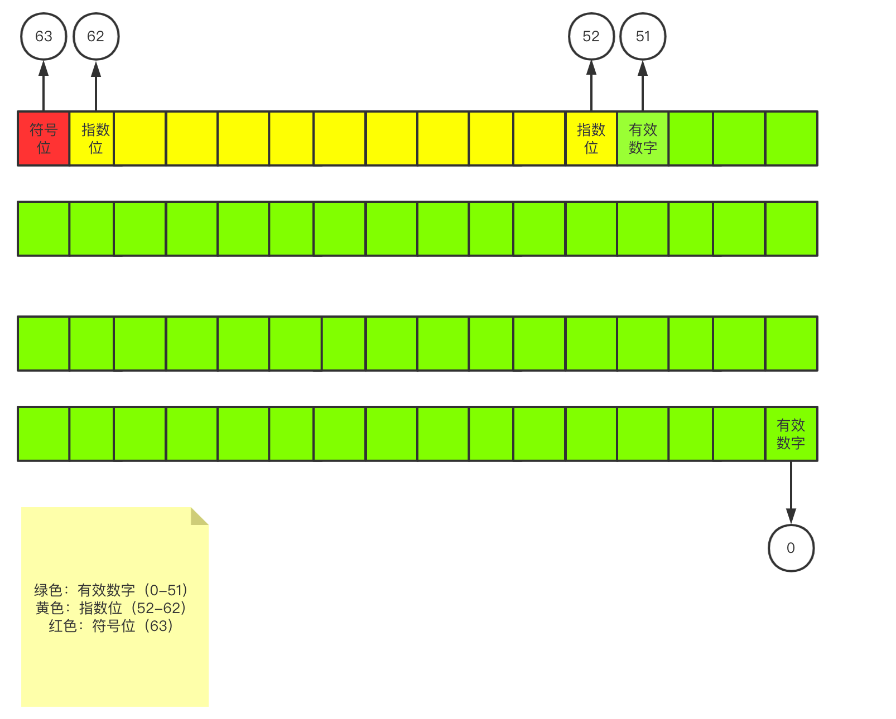

# JavaScript教程

> 阮一峰老师的JavaScript教程
> 地址: https://wangdoc.com/javascript/index.html
> 该笔记只记录自己不清楚的内容和需要注意的内容


## 入门篇

### 1. 语句

语句以分号结尾，一个分号就表示一个语句的结束。多个语句可以写在一行内。
```js
;;;
```
分号内可以没有内容，以上视为三个JavaScript空语句。

### 2. 变量

#### 2.1 概念

* 变量区分大小写。


注意点：

```js
var num; //声明
num = 1; //赋值

var num1 = 1;//声明和赋值

num2 = 1;//直接赋值未声明变量，变量变为全局变量。

//console.log(num3);//直接使用未声明变量，报错

var num3 = 1;
var num3;//重新声明一个声明过的变量，二次声明无效。

var num3 = 2;//但是赋值操作会覆盖。使用let没有这个情况
```


### 3. 标识符

中文是合法的标识符，可以用作变量名。

> JavaScript 有一些保留字，不能用作标识符：arguments、break、case、catch、class、const、continue、debugger、default、delete、do、else、enum、eval、export、extends、false、finally、for、function、if、implements、import、in、instanceof、interface、let、new、null、package、private、protected、public、return、static、super、switch、this、throw、true、try、typeof、var、void、while、with、yield。

### 4. 注释

由于历史上JavaScript可以兼容HTML代码的注释，所以`<!--`和`-->`也被视为合法的的单行注释。

* 注意点：只有`-->`在行首的时候，才会被当成单行注释，否则只会当做正常的运算。

  ```js
  let x;
  
  x = 1; <!--x = 2;
  --> x = 3;
  
  console.log(x);
  ```


### 5. 区块

JavaScript使用大括号，将多个相关的语句组合在一起，称为区块（`block`）。

对于`var`命令来说，JavaScript的区块不构成单独的作用域（`scope`）。（`let`作用域是在区块里面的）。

* `var`的作用域是函数作用域，但是不是块作用域，类似于`if{...}`，`for(){...}`这种块里面使用`var`声明的变量都不是在这个块作用域里面的。
* `let`的作用域是块。

```js
var num1 = 1;

console.log(num1);//1

function demo() {
    
    var num2 = 2;
    let num3 = 3;

    console.log(num2);//2
    console.log(num3);//3
}


//console.log(num2);//报错，没有声明直接使用
//console.log(num3);//报错，没有声明直接使用

if (true) {
    
    var num4 = 4;

}

console.log(num4);//4

for (; 1 ;){
    var num5 = 5;
    break;
}

console.log(num5);//5

while (true) {
    var num6 = 6;
    break;
}

console.log(num6);//6
```


## 数据类型

### 1. 概述

#### 1.1 简介

**JavaScript中的数据类型：**

* `number`
* `string`
* `boolean`
* `undefined`
* `null`
* `object`
* `symbol`（新增）
* `BigInt`（新增）


**原始类型（primitive type）：**

* `number`
* `string`
* `boolean`

> [MDN](https://developer.mozilla.org/zh-CN/docs/Web/JavaScript/Data_structures)将`null` 和`undefined`也算在了原始类型里面，当然了新增的两个也是原始类型。

**合成类型（complex type）：**

* `object`

  * 狭义的对象（object）

  * 数组（array）

  * 函数（function）

    >函数其实是处理数据的方法，JavaScript 把它当成一种数据类型，可以赋值给变量，这为编程带来了很大的灵活性，也为 JavaScript 的“函数式编程”奠定了基础。


#### 1.2 typeof运算符

`typeof`运算符返回一个值的数据类型。

**特殊情况：**

* 空数组和对象使用`typeof`运算符返回的值都是`object`。我们需要使用`instanceof`运算符来判断
  * 数组本质上是一种特殊的对象`arry`
* `null`的类型是`object`，这是由于历史原因造成的。1995年的 JavaScript 语言第一版，只设计了五种数据类型（对象、整数、浮点数、字符串和布尔值），没考虑`null`，只把它当作`object`的一种特殊值。后来`null`独立出来，作为一种单独的数据类型，为了兼容以前的代码，`typeof null`返回`object`就没法改变了。


```js
typeof 123;
typeof '123';
typeof false;
let f = function(){}
typeof f;

console.log(typeof 123);    //number
console.log(typeof '123');  //string
console.log(typeof false);  //boolean
console.log(typeof f);      //function
console.log(typeof null);   //object null
console.log(typeof []);     //object 数组
console.log(typeof {});     //object 对象
```

可以使用`typeof`来检查一个没有声明的变量，而不会报错。

```js
//if(z)未经声明直接使用报错

if (typeof z === 'undefined') {
    // 正确写法
}
```

### 2. null，undefined和布尔值

#### 2.1 null和undefined

##### 2.1.1 null和undefined的历史

1995年 JavaScript 诞生时，最初像 Java 一样，只设置了`null`表示"无"。根据 C 语言的传统，`null`可以自动转为`0`。

但是，JavaScript 的设计者 Brendan Eich，觉得这样做还不够。首先，第一版的 JavaScript 里面，`null`就像在 Java 里一样，被当成一个对象，Brendan Eich 觉得表示“无”的值最好不是对象。其次，那时的 JavaScript 不包括错误处理机制，Brendan Eich 觉得，如果`null`自动转为0，很不容易发现错误。

因此，他又设计了一个`undefined`。区别是这样的：`null`是一个表示“空”的对象，转为数值时为`0`；`undefined`是一个表示"此处无定义"的原始值，转为数值时为`NaN`。

##### 2.1.2 用法

`null`：表示空值，以及空对象`let a = null;`创建一个名为a的空对象。

`undefined`：表示为定义。

#### 2.2 布尔值

* 如果 JavaScript 预期某个位置应该是布尔值，会将该位置上现有的值自动转为布尔值。

  ```js
  if(''){//if括号里面的值预期是一个布尔值，因此''会自动转换成布尔值
    
    console.log('true');
    
  }
  ```

转换规则是除了下面六个值被转为`false`，其他值都视为`true`。

- `undefined`
- `null`
- `false`
- `0`
- `NaN`
- `""`或`''`（空字符串）

### 3. 数值

#### 3.1 概述

##### 3.1.1 整数与浮点数

JavaScript中，所有的数字都以64位浮点数形式存储。

##### 3.1.2 数值精度

根据国际标准IEEE 754，JavaScript浮点数的64个二进制位。

> 阮一峰老师的描述方法和本科阶段学的计组描述方式好像是反的，所以我还是按照第0位在从右数第一个来看。
>
> 参考博客：[IEEE754标准: 一 , 浮点数在内存中的存储方式](https://www.jianshu.com/p/8ee02e9bb57d)

 

```js
(-1)^符号位 * 1.xx...xx * 2^指数部分
```

上面公式是正常情况下（指数部分在0到2047之间），一个数在JavaScript内部实际的表示形式。


精度最多只能到53个金志伟，这意味着，绝对值小于2的53次方的整数，都可以精确显示。

```js
console.log(Math.pow(2, 53));
// 9007199254740992

console.log(Math.pow(2, 53) + 1);
// 9007199254740992

console.log(Math.pow(2, 53) + 2);
// 9007199254740994

console.log(Math.pow(2, 53) + 3);
// 9007199254740996

console.log(Math.pow(2, 53) + 4);
// 9007199254740996

//当超过了能表达的精度的时候，js的计算出现了错误。
```

* 由于2的53次方是一个16位的十进制数值，所以简单的法则就是，JavaScript对15位的十进制数都可以精确处理。


##### 3.1.3 数值范围

64位浮点数的指数部分长度是11个二进制位，所以说指数部分的最大值是2047。所以JavaScript能够表示的范围是2的1024次方到2的-1023次方这个开区间。超过这个范围就没有办法表示。


```js
console.log(Math.pow(2, 1024) + 1);
//Infinity
```

* 当超过了JavaScript所能表示的数据的最大范围的时候，那么就会发生“正向溢出”，即JavaScript无法表示这么大的数，所以返回`Infinity`;


```js
console.log(Math.pow(2, -1023));
//1.1125369292536007e-308

console.log(Math.pow(2, -1075));
//0
```

* 如果一个数值小于等于2的-1075次方（指数部分最小值-1023，再加上小数部分的52位），那么就会发生“负向溢出”，即JavaScript无法表示这么小的数，这个时候回直接返回0。


JavaScript提供`Number`对象的`MAX_VALUE`和`MIN_VALUE`属性，返回可以表示的具体的最大值和最小值。


#### 3.2 数值的表示法

1. 字面量直接表示：`11`，`22`，`0xFF`	
2. 科学计数法表示
   * `123e3`就是123乘以10的三次方
   * `-3.1E+12`就是-3.1乘以10的12次方


以下两种情况JavaScript会自动将数值转换为科学计数法，其他时候采取字面量直接表示

1. 小数点前的数字多于21位。
2. 小数点后的零多于5个。


#### 3.3 数值的进制

* 十进制：最正常的，前面啥都没有
* 二进制：前缀`0b`或者`0B`
* 八进制：前缀`0o`或者`0O`
  * 实际上在非严格模式下`0`作为前缀是可以的。
  * 类似于`089`这种，以`0`为前缀开头，但是并不是八进制数的话，js忽略前缀`0`直接当成十进制
* 十六进制：前缀`0x`或者`0X`


#### 3.4 特殊值

##### 3.4.1 正零和负零

一般来说他俩没啥区别，除了当`+0`和`-0`作为分母的时候。

```js

console.log(0 === -0);      //true
console.log(-0 === +0);     //true
console.log(0 === +0);      //true

console.log((-0).toString());   //0
console.log((+0).toString());   //0

let num1 = (1 / +0);
let num2 = (1 / -0);

console.log(num1 + ' ' + num2);//Infinity -Infinity
console.log(num1 === num2);//false
```

##### 3.4.2 NaN

表示非数字“Not a Number”

* 主要出现在讲字符串解析成数字出错的场合。

* 一些数学函数的运算结果会出现`NaN`

  ```js
  Math.acos(2) // NaN
  Math.log(-1) // NaN
  Math.sqrt(-1) // NaN
  ```

* `0`除以`0`也会得到`NaN`


需要注意的是，`NaN`不是独立的数据类型，而是一个特殊数值，它的数据类型依然属于`Number`，使用`typeof`运算符可以看得很清楚。

```js
typeof NaN // 'number'
```


**运算规则**

* `NaN`不属于任何值，包括自己

  ```js
  NaN === NaN //false
  ```

* 数组的`indexOf`方法内部使用的是严格相等运算符，所以该方法对于`NaN`不成立

* `NaN`在布尔运算时被当做`false`

* `NaN`与任何数（包括自己）的运算，得到的值都是`NaN`。


##### 3.4.3 Infinity

表示无穷。

* 正数太大了，就表示成`Infinity`
* 负数太小了，就表示成`Infinity`
* `0/0`得到`NaN`，当非零值除以`0`的时候返回`Infinity`。
  * `+0`返回`Infinity`
  * `-0`返回`-Infinity`


> 注意:
>
> 由于数值正向溢出（overflow）、负向溢出（underflow）和被`0`除，JavaScript 都不报错，所以单纯的数学运算几乎没有可能抛出错误。


* `Infinity`大于一切数值（除了`NaN`），`-Infinity`小于一切数值（除了NaN）


**运算规则**

* `Infinity`和常数的四则运算符合无穷的数学计算规则。

  几个特殊的情况：

  ```js
  0 * Infinity // NaN
  0 / Infinity // 0
  Infinity / 0 // Infinity
  ```

* `Infinity`加上或者乘以`Infinity`，返回的是`Infinity`

* `Infinity`减去或除以`Infinity`，返回的是`NaN`

* `Infinity`与`null`计算时，`null`会被转成`0`，就和`0`的计算一样了

* `Infinity`与`undefined`计算，返回的是`NaN`


#### 3.5 与数值相关的全局方法

##### 3.5.1 ParseInt()

* 将字符串转换为整数。
  * 如果本来就是整数的话，也会先转为字符串再转换成整数。


各种情况的例子：

```js
// 基本用法
console.log(typeof parseInt('123'));// number
console.log(parseInt('123'));       // 123


// 前面有空格
console.log(parseInt('    123'));   // 123

// 当出现无法转换的字符时
console.log(parseInt('123aaa'));    // 123
console.log(parseInt('asf123'));    // NaN
console.log(parseInt('12e3'));      // 12
console.log(parseInt('0123'));      // 123 当成十进制处理
console.log(parseInt('0x10'));      // 16 转换成10进制
console.log(parseInt('0b10'));      // 0  无法识别二进制
console.log(parseInt('0o888'));     // 0  无法识别八进制
```


科学计数法：

对于那些会自动转为科学计数法的数字，`parseInt`会将科学计数法的表示方法视为字符串，因此导致一些奇怪的结果。

```js
parseInt(1000000000000000000000.5) // 1
// 等同于
parseInt('1e+21') // 1

parseInt(0.0000008) // 8
// 等同于
parseInt('8e-7') // 8
```


方法小结：

* 将字符转换为数字

* 数字会先转换为字符，再转换为数字

  * 对于会自动转换为科学计数法的数字，`parseInt`会将科学计数法形式的数字转为字符串，然后再转为数字。

* 前面有空格将会忽略

* 从遇见的第一个字符（空格会忽略）开始转化，当出现无法转换的（比如`.或者`e`）就会停止

  特殊情况：

  * 如果第一个字符就无法转换 返回`NaN`
  * 如果遇见非十进制数，只有十六进制会转换


**进制转换**

`parseInt`方法还可以接受第二个参数（2到36之间），表示被解析的值的进制，返回该值对应的十进制数。默认情况下，`parseInt`的第二个参数为10，即默认是十进制转十进制。


```js
console.log(parseInt('1000', 2));       // 8 1000作为二进制将其转换为10进制表示
console.log(parseInt('1000', 8));       // 512 

console.log(parseInt('123', 0));        // 123
console.log(parseInt('123', undefined));// 123
console.log(parseInt('123', null));     // 123
console.log(parseInt('321', 88));       // NaN
console.log(parseInt('321', 2));        // NaN 第一位就超过了二进制能表达的范围
console.log(parseInt('10123', 2));      // 5 也就是101的十进制表示后面的数值由于超过了二进制表达范围所以忽略
```


> 这一段有点没看懂
>
> 前面说过，如果`parseInt`的第一个参数不是字符串，会被先转为字符串。这会导致一些令人意外的结果。
>
> ```
> parseInt(0x11, 36) // 43
> parseInt(0x11, 2) // 1
> 
> // 等同于
> parseInt(String(0x11), 36)
> parseInt(String(0x11), 2)
> 
> // 等同于
> parseInt('17', 36)
> parseInt('17', 2)
> ```
>
> 上面代码中，十六进制的`0x11`会被先转为十进制的17，再转为字符串。然后，再用36进制或二进制解读字符串`17`，最后返回结果`43`和`1`。
>
> 这种处理方式，对于八进制的前缀0，尤其需要注意。
>
> ```
> parseInt(011, 2) // NaN
> 
> // 等同于
> parseInt(String(011), 2)
> 
> // 等同于
> parseInt(String(9), 2)
> ```
>
> 上面代码中，第一行的`011`会被先转为字符串`9`，因为`9`不是二进制的有效字符，所以返回`NaN`。如果直接计算`parseInt('011', 2)`，`011`则是会被当作二进制处理，返回3。
>
> JavaScript 不再允许将带有前缀0的数字视为八进制数，而是要求忽略这个`0`。但是，为了保证兼容性，大部分浏览器并没有部署这一条规定。


方法小结：

* `parseInt`方法可以进行进制转换
* `parseInt`方法第二个参数范围必须要在2到36之间
  1. 第二个参数是`0`，`undefined`，`null`直接忽略
  2. 其余的情况返回`NaN`
* 如果说字符串包含对于指定进制无意义的字符，从最高位开始只返回可以转换的数值，如果最高位无法转换，则直接返回`NaN`

##### 3.5.2 parseFloat()

方法将一个字符串转为浮点数。

* 如果符合科学计数法那么会进行相应的转换
* 如果字符包含不能转换为浮点数的字符，则不会向后转换，返回转换好的部分
* 自动过滤字符串前面的空格
* 如果参数不是字符串，或者字符串的第一个字符不能转换为浮点数，那么返回`NaN`

##### 3.5.3 isNaN()

用来判断一个值是否为`NaN`

* `isNaN`方法只对数值有效，如果传入其他值，会被先转成数值。

  ```js
  isNaN('123');
  
  // 等同于
  isNaN(Number('123'));
  ```


判断`NaN`更可靠的方法是，利用`NaN`为唯一不等于自身的值的这个特点，进行判断。

```
function myIsNaN(value) {
  return value !== value;
}
```

##### 3.5.4 isFinite()

`isFinite()`方法返回一个布尔值，表示某个值是否为正常的数值。

方法返回`false`的值

* `Infinity`和`-Infinity`
* `NaN`
* `undefined`


### 4. 字符串


